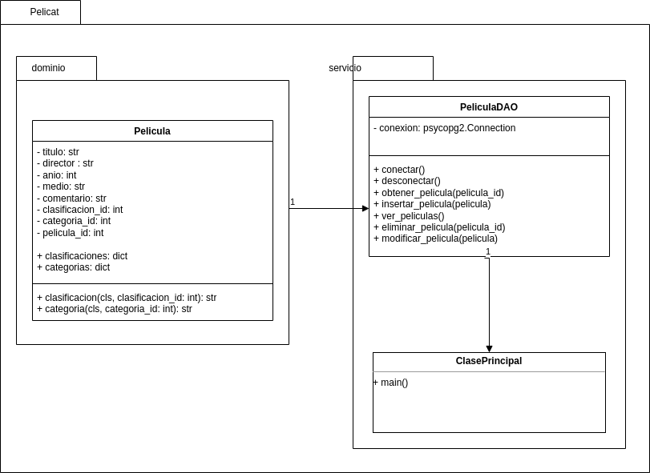

# **Catálogo de peliculas hogareñas: Pelicat**

## **1. Descripción del problema**
Desarrollaremos un pequeño catálogo de películas hogareñas.  A continuación se encuentra la descripción para la aplicación.

La aplicación, que llamaremos **Pelicat**, tiene como objetivo permitir que un usuario cree un catálogo de sus películas hogareñas. Las películas pueden ser recolectadas de varias fuentes en diferentes **medios** (VHS, DVD, VCD, SVCD, Hi8 o miniDV).

El usuario debería poder **categorizar** las películas en clases como: Acción, Aventura, Catástrofe, Ciencia Ficción, Comedia, Documentales, Drama, Fantasía, etc.

Pelicat deberá incluir la **clasificación** de la película (ATP, PG, PG-13, NC16, M18).

La información incluida en el catálogo deberá contener el **título**, **director** y **año** de realización de la película.

Por último, Pelicat deberá tener un campo de **comentarios** donde el usuario pueda ingresar cualquier otra información que desee sobre la película.

El usuario podrá buscar películas en el catalogo, agregar nuevas películas y editar o eliminar las películas existentes.

### **2. Como se utiliza la aplicación.**
Estas son las principales funciones de Pelicat que permiten al usuario administrar su catálogo de películas hogareñas.

1. Agregar nueva película: El usuario utiliza esta función para agregar una nueva película a su catálogo de películas hogareñas. Proporciona los detalles de la película, como el título, director, año de realización, medio y categoría. Opcionalmente, puede agregar un comentario personal sobre la película. Se selecciona la opción "Agregar nueva película" en la aplicación, luego se completan los campos requeridos con la información de la película.
1. Editar película existente: El usuario utiliza esta función para editar la información de una película existente en su catálogo. Puede modificar cualquier detalle de la película.  Se selecciona la película que desea editar en el catálogo. Luego accede a la opción "Editar película" y realiza los cambios deseados en los campos correspondientes.
1. Eliminar película: El usuario utiliza esta función para eliminar una película de su catálogo. Al eliminar una película, se eliminarán todos los datos asociados. Se selecciona la película que se desea eliminar en el catálogo. Luego accede a la opción "Eliminar película" y se eliminan todos sus datos.
1. Buscar películas en el catalogo: puede realizar la búsqueda utilizando diferentes criterios, como título, director, categoría o clasificación. Se accede a la opción "Buscar películas" en la aplicación. Luego ingresa los criterios de búsqueda deseados, como el título de la película o el nombre del director. La aplicación muestra los resultados de la búsqueda, que coinciden con los criterios especificados.
1. Ver detalles de una película: Descripción: El usuario utiliza esta función para ver los detalles completos de una película en su catálogo, incluyendo título, director, año, medio, categoría, clasificación y comentarios.
   ## **3. Análisis del dominio del problema**
El análisis del dominio del problema se realiza mediante la creación de un modelo conceptual, que es representado por un conjunto de diagramas de clases en UML.

En este modelo, se identifican clases conceptuales, se establecen relaciones entre ellas y se definen sus atributos. El proceso de elaboración del modelo de dominio consta de tres pasos:

1\. Identificar las clases conceptuales.

2\. Dibujar las clases en un diagrama de clases.

3\. Y agregar relaciones y atributos.

Las clases conceptuales son objetos o entidades del dominio, como personas, máquinas, lugares, ventas, permisos, entre otros. Se deben extraer los sustantivos de la descripción del problema y también se pueden añadir clases basadas en el conocimiento del área, incluso si no se mencionan explícitamente en el problema.

3\.1 A continuación, se realizará un análisis del dominio del problema basado en la descripción:

**Clases conceptuales:**

- Película: Representa una película casera.
- Medio: Hace referencia al formato de la película (VHS, DVD, VCD, SVCD, Hi8 o miniDV).
- Categoría: Indica la clasificación temática de una película (Acción, Aventura, Catástrofe, Ciencia Ficción, Comedia, Documentales, Drama, Fantasía, etc.).
- Clasificación: Es la calificación de la película (ATP, PG, PG-13, NC16, M18).

**Atributos:**

- Película: título, director, año de realización, medio, comentario.
- Categoría: nombre de la categoría.
- Clasificación: tipo de calificación.

**Relaciones identificadas:**

1. Una película debe tener al menos un medio y un medio puede estar asociado a varias películas.
1. Una película debe tener una categoría, y una categoría puede estar asociada a varias películas.
1. Una película tiene una clasificación.
1. La aplicación es utilizada por un usuario.

**Funcionalidades requeridas:**

1. Agregar una nueva película al catálogo.
1. Editar información de una película existente.
1. Eliminar una película del catálogo.
1. Categorizar las películas en diferentes categorías temáticas.
1. Asignar clasificación a las películas.
1. Registrar comentarios y notas personales para cada película.
1. Registrar el medio en el que se encuentra una película (cinta, DVD, etc.).
1. Permitir la búsqueda de películas en la colección.
1. Mostrar información detallada de una película específica.
   ## **4. Diseño de Pelicat**
El objetivo de la fase de diseño es cubrir los detalles y crear un diseño que pueda convertirse en la implementación final en código. Esto significa que no solo consideramos qué hará el programa y cuál será su organización principal, sino que también especificamos los detalles de programación, las bibliotecas que utilizaremos y todos lo necesario para obtener una implementación funcional.

Creamos el paquete pelicat que contendrá todo el código de la aplicación.

Luego creamos el paquete dominio para definir las clases que representan conceptos fundamentales de la aplicación, como es en este caso la clase Película.

La clase pelicula continene metodos de clase: clasificacion y categoría y tambien tiene parametros de clase: los diccionarios clasificaciones y categorias.

Creamos el paquete servicio que lo uitlizaremos para alojar la logica de la aplicación y las operaciones relacionadas con el manejo de la base de datos.

En el caso de main(), PeliculaDAO y Pelicula, la relación es más bien de dependencia o asociación, ya que main() utiliza la funcionalidad de PeliculaDAO para realizar operaciones en la base de datos, y PeliculaDAO interactúa con objetos de la clase Pelicula. No hay una relación de "contenedor-contenido" ni una dependencia de vida que indique una agregación o composición.
## **5. Diseño de la base de datos**
El diseño de la base de datos dependerá de varios factores, como los requisitos específicos de la aplicación, la cantidad de datos que manejará, las consultas que realizará con mayor frecuencia y otros aspectos relacionados con la eficiencia y la integridad de los datos. A continuacion listamos  algunas pautas generales para el diseño de la base de datos de la aplicación "Pelicat":

Identificar las entidades principales: Analizar los componentes principales de la aplicación, como las películas, categorías, formato,  etc. Estas entidades se convertirán en las tablas principales de tu base de datos.

`    `Definir las relaciones entre las entidades: Determina cómo se relacionan las diferentes entidades entre sí. Por ejemplo, una película puede tener múltiples categorías pero tendrá un unico formato. Utilizaremos relaciones uno a uno, uno a muchos o muchos a muchos según corresponda.

`    `Establecer las claves primarias: Cada tabla debe tener una clave primaria que identifique de manera única cada registro. Puedes utilizar un campo autoincremental (como un ID) o una combinación de campos que sean únicos.

`    `Considerar la normalización: Aplica las reglas de normalización para evitar redundancia de datos y garantizar la integridad de la base de datos. Divide la información en tablas relacionadas de manera lógica y evita la duplicación innecesaria de datos.

`    `Definir las restricciones y validaciones: Utiliza restricciones de integridad para garantizar que los datos cumplan con ciertas reglas. Por ejemplo, puedes establecer restricciones de clave foránea para mantener la coherencia de las relaciones entre las tablas.

`    `Optimizar el rendimiento: Considera las consultas que se realizarán con mayor frecuencia y diseña los índices adecuados para acelerar esas consultas. Evalúa también las necesidades de escalabilidad y rendimiento a largo plazo de tu aplicación.

Veamos como estructurar las tabla de la base de datos:
### **5.2 Código SQL para generar las tablas**

|

CREATE TABLE public.peliculas (

`    `pelicula\_id SERIAL PRIMARY KEY,

`    `titulo character varying NOT NULL,

`    `director character varying,

`    `anio integer,

`    `medio character varying NOT NULL,

`    `comentario character varying,

`    `clasificacion\_id integer NOT NULL,

`    `categoria\_id integer NOT NULL

);
|
| :- |

- pelicula\_id: Identificador único de la película (generado automáticamente).
- titulo: Título de la película (cadena de caracteres).
- director: Director de la película (cadena de caracteres).
- anio: Año de lanzamiento de la película (valor numérico).
- medio: Medio en el que se encuentra la película (cadena de caracteres).
- comentario: Comentario o descripción adicional de la película (texto).
- clasificacion\_id: ID numérico de la clasificación de la película.
- categoria\_id: ID numérico de la categoría de la película.

## **6. Definiciones de clases:**
Basándonos en la estructura de la base de datos definida previamente, escribimos la definición de la clases correspondiente, teniendo en cuenta que debemos incluir el método \_\_str\_\_ para que sea imprimible y encapsulamos los atributos, por lo tanto debemos incluir los métodos setters y getters.

|
class Pelicula: `    `clasificaciones = { `        `1: 'ATP', `        `2: 'PG', `        `3: 'PG-13', `        `4: 'NC16', `        `5: 'M-18'} `    `categorias = { `        `1: 'Acción', `        `2: 'Aventura', `        `3: 'Catástrofe', `        `4: 'Ciencia Ficción', `        `5: 'Comedia', `        `6: 'Documentales', `        `7: 'Drama', `        `8: 'Fantasía’}

`    `@classmethod `    `def clasificacion(cls, clasificacion\_id): `        `return cls.clasificaciones.get(clasificacion\_id, 'Desconocido')  `    `@classmethod `    `def categoria(cls, categoria\_id): `        `return cls.categorias.get(categoria\_id, 'Desconocido')  `    `def \_\_init\_\_(self, titulo, director, anio, medio, comentario, clasificacion\_id, categoria\_id): `        `self.\_titulo = titulo `        `self.\_director = director `        `self.\_anio = anio `        `self.\_medio = medio `        `self.\_comentario = comentario `        `self.\_clasificacion\_id = clasificacion\_id `        `self.\_categoria\_id = categoria\_id `        `self.\_pelicula\_id = None
|
| :- |

No agregamos los métodos setters y getters para no visualizar tanto código.

Incluimos dos metodos de clase: clasificacion y categoria que retornan el valor textual de los valores numericos de la clasificacion y categoria respectivamente.

También incluimos dos diccionarios de clase que son utilizados para convertir los valores numericos de la categoria y clasificacion a valores textuales.

## **7. Acceso a la base de datos**
Utlizaremos como motor de base de datos a Postgresql y para realizar la conexión utilizaremos el módulo psycopg2 porque es el más popular y estable para trabajar con PostgreSQL, ademas se utiliza en la mayoría de los frameworks de Python y es compatible con las versiones de Python 2 y 3 y está diseñado para aplicaciones con un alto grado de multi-hilos.

para utilizar la biblioteca psycopg2 se necesita instalar un módulo en tu entorno de desarrollo. Aquí explico cómo instalarlo:

Asegúrate de tener pip instalado en tu sistema. pip es el gestor de paquetes de Python que se utilizapython3-dev para instalar módulos externos.

Una vez que tienes pip instalado, puedes instalar psycopg2 ejecutando el siguiente comando en tu terminal:

pip install psycopg2

Para el acceso a la base de datos, utilizaremos la clase PeliculaDAO, la cual  es una clase que actúa como un Data Access Object (DAO) para la entidad "Pelicula". PeliculaDAO proporciona una interfaz para interactuar con la base de datos y realizar operaciones CRUD (crear, leer, actualizar, eliminar) en relación a la entidad "Pelicula". Simplifica la interacción con la base de datos y separa la lógica de acceso a datos de la lógica de negocio en una aplicación.

Los métodos principales que ofrece PeliculaDAO son:

- insertar\_pelicula: Este método recibe los datos de una película y ejecuta una consulta SQL para insertar un nuevo registro en la tabla peliculas de la base de datos.

- ver\_peliculas: Este método ejecuta una consulta SQL para recuperar todos los registros de películas de la tabla peliculas y los muestra por pantalla.

- eliminar\_pelicula: Este método recibe el ID de una película y ejecuta una consulta SQL para eliminar el registro correspondiente de la tabla peliculas en la base de datos.

- modificar\_pelicula: Este método recibe el ID de una película y los nuevos datos de la película. Ejecuta una consulta SQL para actualizar el registro correspondiente en la tabla peliculas con los nuevos valores.

Además, PeliculaDAO utiliza el bloque with, para asegurar una correcta gestión de recursos y la finalización de la transacción mediante el commit o rollback de los cambios.

